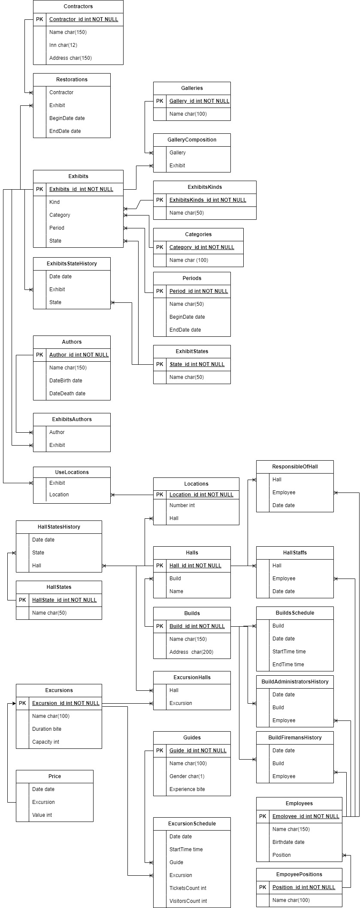

# База данных в музее

1. [Описание структуры базы данных](#structure)
2. [Связи таблиц](#tablerelations)
3. [Типовые сценарии использования](#scenarios)

## Описание структуры базы данных<a name="structure"></a>

1. **Exhibits** - Экспонаты
    - Exhibits_id - int- первичный ключ
    - Kind - int - ключ значения из таблицы ExhibitsKinds
    - Category - int - ключ значения из таблицы Categories
    - Period - int - ключ значения из таблицы Periods
    - State - int - ключ значения из таблицы ExhibitStates
    - Name - string - название экспоната
2. **ExhibitsKinds** - Виды экспонатов (Картина, скульптура, икона)
    - ExhibitsKinds - int- первичный ключ
    - Name - string - наименование 
3. **Authors** - Авторы
    - Author_id - int- первичный ключ
    - Name - string - ФИО
    - DateBirth - date - дата рождения
    - DateDeath - date - дата смерти
4. **ExhibitsAuthors** - Авторы экспонатов. Связь между экспонатом и авторами. У экспоната может быть много авторов и у автора много экспонатов.
    - Author - int - ключ значения из таблицы Authors
    - Exhibit - ключ значения из таблицы Exhibits
5. **Categories** - Категрии: апликация, живопись, иконопись.
    - Category_id - int- первичный ключ
    - Name - string - наименование
6. **Periods** - периоды: первая половина XIX в, XXI в.
    - Period_id - int- первичный ключ 
    - Name - string - наименование 
    - BeginDate - date - дата начала периода 
    - EndDate - date - дата окончания периода 
7. **Galleries** - галереи: коллекция "Мир", коллекция участников.
    - Gallery_id - int- первичный ключ
    - Name - string - наименование 
8. **GalleryComposition** - состав композиции: экспонаты, входящие в композицию.
    - Gallery - int - ключ значения из таблицы Galleries
    - Exhibit - int - ключ значения из таблицы Exhibits
9. **ExhibitStates** - состояние экспоната: в зале, на складе, на реставрации
    - State_id - int- первичный ключ
    - Name - string - наименование 
10. **Builds** - здания музея.
    - Build_id - int- первичный ключ 
    - Name - string - наименование 
    - Address - string - адрес  
11. **Halls** - выставочные залы.
    - Hall_id - int- первичный ключ 
    - Build - int - ключ значения из таблицы Builds
    - Name - string - наименование
12. **Locations** - зоны размещения экспонатов в зале.
    - Location_id - int- первичный ключ 
    - Number - int - номер зоны размещения
    - Hall - int - ключ значения из таблицы Halls
13. **UseLocations** - размещение экспонатов по зонам размещения в залах.
    - Exhibit - int - ключ значения из таблицы Exhibits
    - Location - int - ключ значения из таблицы Locations
14. **BuildsSchedule** - расписание работы зданий музея.
    - Build - int - ключ значения из таблицы Builds
    - Date - date - дата
    - StartTime - time - время начала работы
    - EndTime - time - время окончания работы
15. **Excursions** - экскурсии
    - Excursion_id - int- первичный ключ 
    - Name - string - наименование 
    - Duration - byte - длительность
    - Capacity - byte - максимальное количество участников
16. **ExcursionHalls** - залы, входящие в каждую экскурсию.
    - Hall - int - ключ значения из таблицы Halls
    - Excursion - int - ключ значения из таблицы Excursions
17. **Guides** - гиды, проводящие экскурсии.
    - Guide_id - int- первичный ключ
    - Name - string - наименование 
    - Gender - char - пол 
    - Experience - byte - стаж работы
18. **ExcursionSchedule** - расписание экскурсий.
    - Date - date - дата
    - StartTime - time - время начала 
    - Guide - int - ключ значения из таблицы Guides
    - Excursion - int - ключ значения из таблицы Excursions
    - TicketsCount - byte - количество проданных билетов 
    - VisitorsCount - byte - фактическое количество участников
19. **ExhibitsStateHistory** - история изменений состояния экспоната: передача на реставрацию, возврат из реставрации, передача на склад, возврат со склада, перемещение в другой зал
    - Date - date - дата изменения состояния
    - Exhibit - int - ключ значения из таблицы Exhibits
    - State - int - ключ значения из таблицы ExhibitStates
20. **Price** - прейскурант цен на экскурсии по датам
    - Date - date - дата
    - Excursion - int - ключ значения из таблицы Excursion
    - Value - int - цена
21. **Contractors** - контрагенты: реставраторы, поставщики, подрядчики
    - Contractor_id - int- первичный ключ 
    - Name - string - наименование 
    - Inn - string - ИНН
    - Address - string - адрес
22. **Restorations** - периоды реставрации картин подрядчиками
    - Contractor - int - ключ значения из таблицы Contractors
    - Exhibit - int - ключ значения из таблицы Exhibits
    - BeginDate - date - дата начала реставрации
    - EndDate - date - дата окончания реставрации
23. **Employees** - работники музея
    - Emoloyee_id - int- первичный ключ 
    - Name - string - наименование 
    - Birthdate - date - дата рождения
    - Position - int - ключ значения из таблицы EmpoyeePositions
24. **EmpoyeePositions** - должности работников
    - Position_id - int- первичный ключ 
    - Name - string - наименование 
25. **HallStaffs** - распределение работников по залам по датам
    - Hall - int - ключ значения из таблицы Halls
    - Employee - int - ключ значения из таблицы Employees
    - Date - date - дата
26. **ResponsibleOfHall** - ответственные за залы по датам
    - Hall - int - ключ значения из таблицы Halls
    - Employee - int - ключ значения из таблицы Employees
    - Date - date - дата 
26. **HallStates** - состояния залов: работает, не работает, на ремонте
    - HallState_id - int- первичный ключ 
    - Name - string - наименование 
27. **HallStatesHistory** - состояния залов по датам
    - Date - date - дата 
    - State - int - ключ значения из таблицы HallStates
    - Hall - int - ключ значения из таблицы Halls
29. **BuildAdministratorsHistory** - администраторы зданий по датам
    - Date - date - дата 
    - Build - int - ключ значения из таблицы Builds
    - Employee - int - ключ значения из таблицы Employees
30. **BuildFiremansHistory** - отвественные за пожарную безопасность зданий по датам
    - Date - date - дата 
    - Build - int - ключ значения из таблицы Builds
    - Employee - int - ключ значения из таблицы Employees

## Связи таблиц <a name="tablerelations"></a>



## Типовые сценарии использования <a name="scenarios"></a>

### Найти где находится конкретный экспонат (`Exhibits_id=250`)
```sql
Select
Builds.Name as BuildName,
Halls.Name as HallName,
Builds.Address as Address
From UseLocations
Inner join Locations
on UseLocations.Location = Locations.Location_id
Inner join Halls
on Locations.Hall = Halls.Hall_id
Inner join Builds
on Halls.Build = Builds.Build_id 
Where UseLocations.Exhibit = 250
```
### Выбрать экспонаты одного автора (`Author_id=200`)

```sql
Select
Exhibits.name
From ExhibitsAuthors
Inner Join Exhibits
on ExhibitsAuthors.Exhibit = Exhibits.Exhibits_id 
Where ExhibitsAuthors.Author = 200
```

### Выбрать экспонаты одного периода (`Period_id =150`)
```sql
Select
name
From Exhibits
Where Period = 150
```
### Выбрать экскурсии в определенный день, в которых можно посетить определенный зал (`Hall_id=5`, `Date='20230101'`)
```sql
Select
Excursions.Name as ExcursionName,
ExcursionSchedule.StartTime as StartTime
From ExcursionHalls
Inner join ExcursionSchedule
on ExcursionHalls.Excursion = ExcursionSchedule.Excursion
Inner join Excursions
on ExcursionHalls.Excursion = Excursions.Excursion_id 
Where
ExcursionHalls.Hall=5 and ExcursionSchedule.Date='20230101'
```